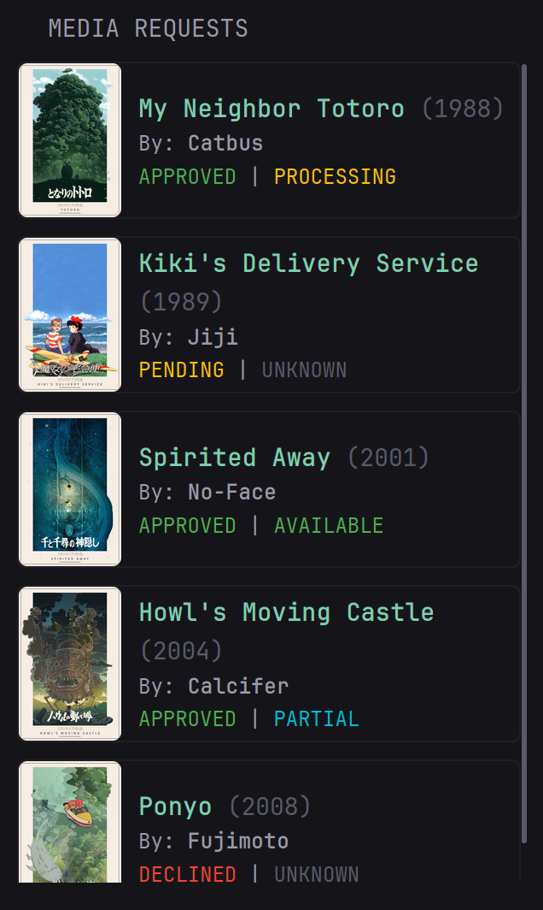

# Glance Media Requests Widget

A lightweight Go proxy that sits between [Glance](https://github.com/glanceapp/glance) and [Seerr](https://github.com/seerr-team/seerr), exposing a clean `/requests` endpoint for use in a Glance Seerr dashboard widget.

<p align="center">
  
</p>

## Features

- Fetches and caches the latest media requests from Seerr
- Webhook endpoint to trigger instant cache refreshes on new requests
- Per-IP rate limiting
- Bearer token auth on `/requests`
- Constant-time webhook secret validation
- 24-hour metadata cache with daily background refresh
- ~4 MB memory footprint

## Endpoints

| Endpoint | Method | Description |
|---|---|---|
| `/requests` | GET | Returns cached list of media requests as JSON |
| `/webhook` | POST | Triggers a cache refresh (called by Seerr on request events) |

---

## Deployment

### 1. Clone the repo

```bash
git clone https://github.com/DenushanGithub/glance-seerr-widget . && cp .env.example .env
```

Open `.env` and fill in your values — see [Environment Variables](#environment-variables) below for where to find each one.

### 2. Build the image

```bash
go mod tidy
docker build -t glance-seerr-api:latest .
```

### 3. Start the container

```bash
docker compose up -d
```

That's it. The proxy is now running on port `5005`.

---

## Environment Variables

| Variable | Required | Description |
|---|---|---|
| `SEERR_URL` | Yes | Base API URL of your Seerr instance |
| `SEERR_API_KEY` | Yes | API key from Seerr's settings page |
| `WEBHOOK_AUTH_HEADER` | No | A secret you generate — used to authenticate Seerr's webhook calls |
| `REQUESTS_AUTH_TOKEN` | No | A secret you generate — used by Glance to authenticate against `/requests` |
| `TZ` | No | Container timezone (default: `America/Toronto`) |
| `GOMEMLIMIT` | No | Go runtime memory limit (default: `4MiB`) |

### How to get each value

**`SEERR_URL`**
The base URL of your Seerr instance, with `/api/v1` appended:
```
http://<YOUR_SERVER_IP>:5055/api/v1
```

**`SEERR_API_KEY`**
In Seerr go to **Settings → General** and copy the API key shown there.

**`WEBHOOK_AUTH_HEADER`**
A random secret string you generate yourself. It gets set here in `.env` and also entered into Seerr's webhook settings so that only Seerr can trigger a cache refresh. Generate one with:
```bash
openssl rand -base64 32
```

[Configure the Seerr Webhook](#Configure-the-Seerr-Webhook)

**`REQUESTS_AUTH_TOKEN`**
A random secret string you generate yourself. It gets set here in `.env` and also added to your Glance widget config as the Bearer token. Generate one with:
```bash
openssl rand -base64 32
```

---

## docker-compose.yml

```yaml
services:
  seerr-api:
    image: glance-seerr-api:latest
    init: true
    container_name: glance-seerr-request-feed
    environment:
      - TZ=America/Toronto
      - SEERR_URL=${SEERR_URL}
      - SEERR_API_KEY=${SEERR_API_KEY}
      - WEBHOOK_AUTH_HEADER=${WEBHOOK_AUTH_HEADER}
      - REQUESTS_AUTH_TOKEN=${REQUESTS_AUTH_TOKEN}
      - GOMEMLIMIT=4MiB
    ports:
      - 5005:5000
    restart: unless-stopped
```

---

## Configure the Seerr Webhook

In Seerr navigate to **Settings ➔ Notifications**, and click the cog icon next to **Webhook**. Fill in the following fields:

*   **Enable Agent:** Toggle this switch **ON**.
*   **Webhook URL:** Set to `http://<YOUR_SERVER_IP>:5005/webhook`
*   **Authorization Header:** Paste the secret string you generated above.
*   **Notification Types:** Check the boxes for:
    *   Request Pending Approval
    *   Request Automatically Approved
    *   Request Approved
    *   Request Declined
    *   Request Available
    *   Request Processing Failed

Once filled out, scroll to the bottom and click **Test** to ensure the proxy successfully receives the signal, then hit **Save**. This makes Seerr ping the proxy whenever a request changes, keeping the cache fresh instantly. If the webhook is not configured, the cache refreshes once daily.

---

## Glance Widget Config

Add this to your Glance config, replacing the placeholders with your actual host and `REQUESTS_AUTH_TOKEN`:

```yaml
- type: custom-api
  title: Media Requests
  # update-interval: 5s  # Dynacat only — remove this line if using standard Glance
  frameless: true
  title-url: http://<YOUR_SERVER_IP>:5055/requests
  url: http://<YOUR_SERVER_IP>:5005/requests
  cache: 5m
  headers:
    Authorization: "Bearer <REQUESTS_AUTH_TOKEN>"
  template: |
    {{ $request_list := .JSON.Array "results" }}
    {{ if gt (len $request_list) 0 }}
      <ul class="list list-gap-10" style="max-height: 480px; overflow-y: auto; overflow-x: hidden; padding-right: 5px;">
      {{ range $request_list }}
        <li class="flex items-center gap-10 thumbnail-container thumbnail-parent">
          <a href="http://<YOUR_SERVER_IP>:5055/{{ .String "type" }}/{{ .Int "tmdbId" }}" target="_blank">
            {{ $poster := .String "poster" }}
            {{ if ne $poster "" }}
              
            {{ else }}
              <div style="border-radius: 5px; min-width: 6rem; max-width: 6rem; aspect-ratio: 2/3; background: #333; display: flex; align-items: center; justify-content: center;" class="card">
                <span class="color-subdue">No Poster</span>
              </div>
            {{ end }}
          </a>
          <div class="flex-1" style="padding-right: 5px;">
            <p class="color-positive size-h4 text-truncate-2-lines margin-top-2">
              <strong style="text-transform: capitalize;">{{ .String "title" }}</strong>
              <span class="color-subdue">({{ or (.String "year") "UNKNOWN" }})</span>
            </p>
            <p class="size-h5">By: <b>{{ .String "requestedBy" }}</b></p>
            <p class="size-h5">
              {{ $req := .Int "requestStatus" }}
              {{ if eq $req 1 }}      <span style="color: #ffc107;">PENDING</span>
              {{ else if eq $req 2 }} <span style="color: #4caf50;">APPROVED</span>
              {{ else if eq $req 3 }} <span style="color: #f44336;">DECLINED</span>
              {{ else if eq $req 4 }} <span style="color: #f44336;">FAILED</span>
              {{ else if eq $req 5 }} <span style="color: #4caf50;">APPROVED</span> 
              {{ else }}              <span class="color-subdue">REQ ({{ $req }})</span>
              {{ end }}
              |
              {{ $med := .Int "mediaStatus" }}
              {{ if eq $med 1 }}      <span class="color-subdue">UNKNOWN</span>
              {{ else if eq $med 2 }} <span style="color: #2196f3;">PENDING</span>
              {{ else if eq $med 3 }} <span style="color: #ffc107;">PROCESSING</span>
              {{ else if eq $med 4 }} <span style="color: #00bcd4;">PARTIAL</span>
              {{ else if eq $med 5 }} <span style="color: #4caf50;">AVAILABLE</span>
              {{ else if eq $med 6 }} <span style="color: #f44336;">BLACKLISTED</span>
              {{ else if eq $med 7 }} <span style="color: #f44336;">DELETED</span>
              {{ else }}              <span class="color-subdue">MED ({{ $med }})</span>
              {{ end }}
            </p>
          </div>
        </li>
      {{ end }}
      </ul>
    {{ else }}
      <p class="color-subdue">No recent requests found.</p>
    {{ end }}
```

---

## Response Format

`GET /requests` returns:

```json
{
  "results": [
    {
      "title": "My Neighbor Totoro",
      "year": "1988",
      "poster": "/path/to/poster.jpg",
      "type": "movie",
      "tmdbId": 8392,
      "requestedBy": "Catbus",
      "requestStatus": 2,
      "mediaStatus": 3
    }
  ]
}
```

`requestStatus` and `mediaStatus` map to Seerr's internal status codes.
